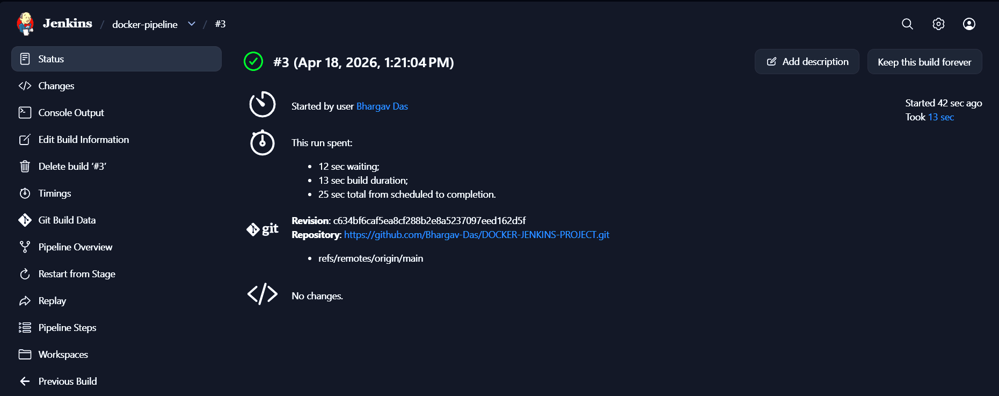
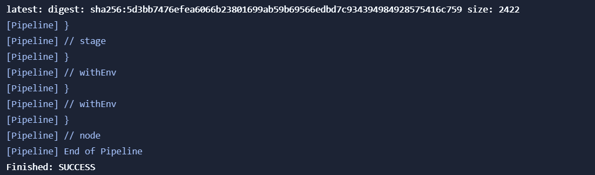
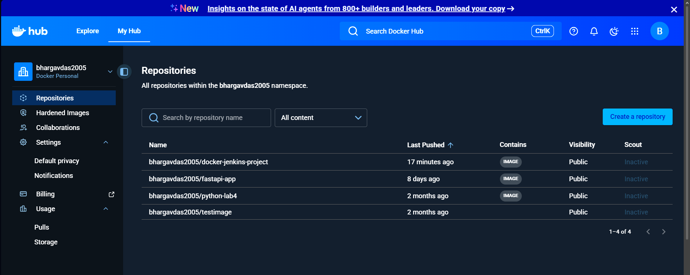
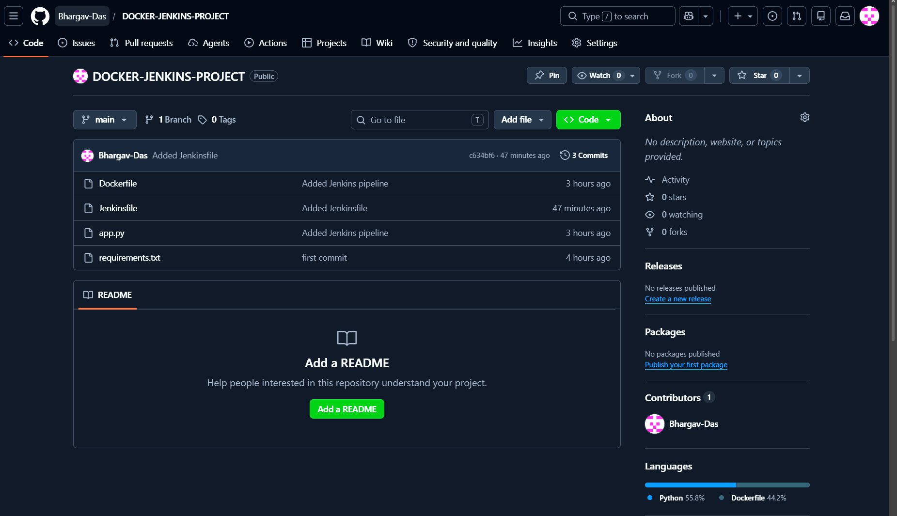

# Docker CI/CD Pipeline using Jenkins

## Project Overview

This project demonstrates an automated CI/CD pipeline using **Jenkins**, **Docker**, **GitHub**, and **Docker Hub**. Whenever source code is updated in the GitHub repository, Jenkins can pull the latest code, build a Docker image, authenticate with Docker Hub, and push the latest image automatically.

## Objective

To automate the software build and container image delivery process using DevOps tools.

## Tools & Technologies Used

* Jenkins (Pipeline Automation)
* Docker (Containerization)
* Git & GitHub (Source Control)
* Docker Hub (Image Registry)
* VS Code (Development Environment)
* WSL / Linux Terminal
* Python Flask (Sample App)

## Project Architecture

1. Developer pushes code to GitHub.
2. Jenkins fetches the repository.
3. Jenkins reads `Jenkinsfile`.
4. Jenkins builds Docker image.
5. Jenkins logs in to Docker Hub using stored credentials.
6. Jenkins pushes the image to Docker Hub.

## Repository Structure

```text
DOCKER-JENKINS-PROJECT/
├── app.py
├── requirements.txt
├── Dockerfile
├── Jenkinsfile
└── README.md
```

## Source Files

### app.py

Python Flask sample application.

### requirements.txt

```txt
flask
```

### Dockerfile

```dockerfile
FROM python:3.10
WORKDIR /app
COPY . .
RUN pip install -r requirements.txt
EXPOSE 5000
CMD ["python", "app.py"]
```

### Jenkinsfile

```groovy
pipeline {
    agent any

    environment {
        IMAGE_NAME = "bhargavdas2005/docker-jenkins-project"
        TAG = "latest"
    }

    stages {
        stage('Build Docker Image') {
            steps {
                sh 'docker build -t $IMAGE_NAME:$TAG .'
            }
        }

        stage('Docker Login') {
            steps {
                withCredentials([usernamePassword(
                    credentialsId: 'dockerhub-creds',
                    usernameVariable: 'USER',
                    passwordVariable: 'PASS'
                )]) {
                    sh 'echo $PASS | docker login -u $USER --password-stdin'
                }
            }
        }

        stage('Push Image') {
            steps {
                sh 'docker push $IMAGE_NAME:$TAG'
            }
        }
    }
}
```

## Jenkins Configuration Steps

1. Install Jenkins in Docker container.
2. Install required plugins:

   * Pipeline
     n   - Git
   * Docker Pipeline
3. Add Docker Hub credentials in Jenkins:

   * Kind: Username with password
   * ID: `dockerhub-creds`
4. Create new Pipeline Job.
5. Choose **Pipeline script from SCM**.
6. Select Git repository URL.
7. Branch: `*/main`
8. Script path: `Jenkinsfile`
9. Click **Build Now**.

## Commands Used

```bash
git add .
git commit -m "Added Jenkins pipeline"
git push origin main
```

## Successful Output

```text
Finished: SUCCESS
```

Docker image pushed successfully to Docker Hub:

```text
bhargavdas2005/docker-jenkins-project:latest
```

## Project Screenshots

### 1. Jenkins Pipeline Successful Build

*Add screenshot file: `images/jenkins-success.png`*

```md

```

### 2. Jenkins Console Output (Finished: SUCCESS)

*Add screenshot file: `images/console-success.png`*

```md

```

### 3. Docker Hub Repository (Image Pushed Successfully)

*Add screenshot file: `images/dockerhub-repo.png`*

```md

```

### 4. GitHub Repository Structure

*Add screenshot file: `images/github-repo.png`*

```md

```

> Create an `images/` folder in the repository root and place all screenshots there before pushing to GitHub.

## Learning Outcomes

* Understanding CI/CD pipeline workflow
* Docker image creation and registry push
* Jenkins credentials management
* SCM integration with GitHub
* Real-world DevOps automation process

## Viva Questions & Answers

### Q1. What is Jenkins?

Jenkins is an open-source automation server used for CI/CD pipelines.

### Q2. Why Docker is used?

Docker packages applications with dependencies into portable containers.

### Q3. What is CI/CD?

Continuous Integration and Continuous Delivery automate build, test, and deployment processes.

### Q4. Why use credentials in Jenkins?

To securely store usernames, passwords, and tokens.

## Output Summary

```text
Build Status      : SUCCESS
Docker Image Name : bhargavdas2005/docker-jenkins-project:latest
Repository        : GitHub + Docker Hub
Automation Tool   : Jenkins
```

## How to Present to Teacher

1. Explain the objective of CI/CD automation.
2. Show repository files: Dockerfile, Jenkinsfile, app.py.
3. Explain Jenkins pipeline stages:

   * Build Docker Image
   * Docker Login
   * Push Image
4. Show Jenkins green successful build.
5. Show Docker Hub pushed image.
6. Explain learning outcomes and real industry usage.

## Conclusion

This project successfully automated the Docker image build and push process using Jenkins Pipeline. It demonstrates practical DevOps implementation used in real software delivery environments. The project integrates source control, containerization, automation, and cloud image registry into one complete workflow.
